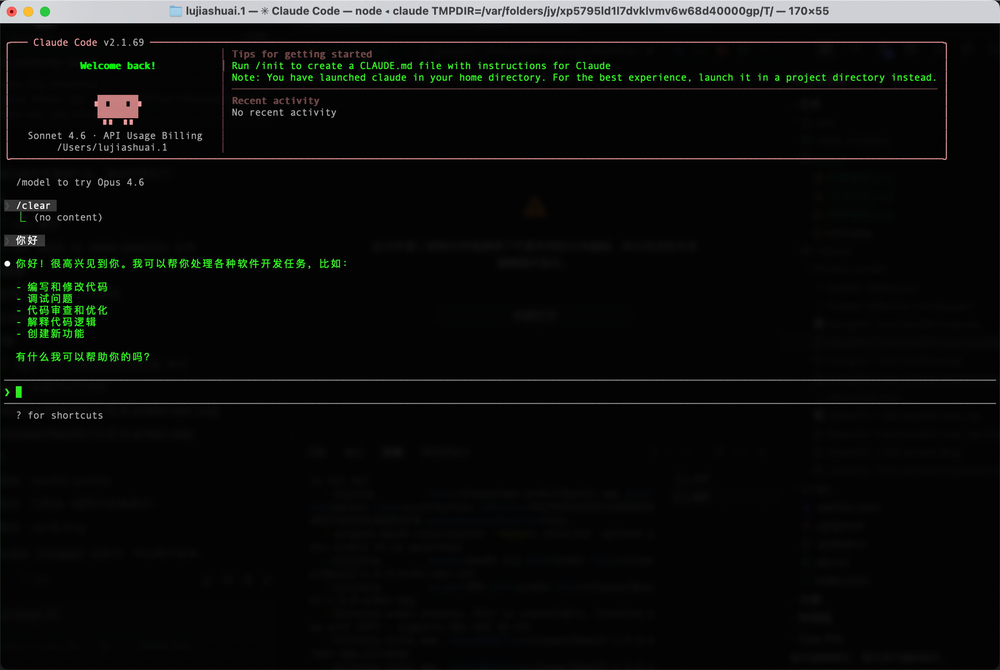
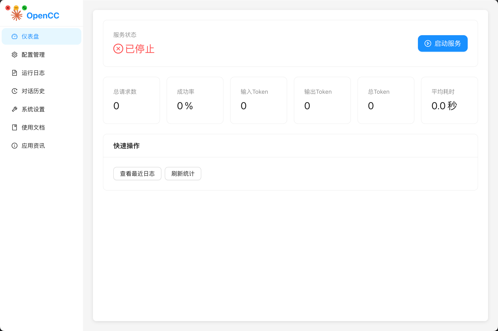
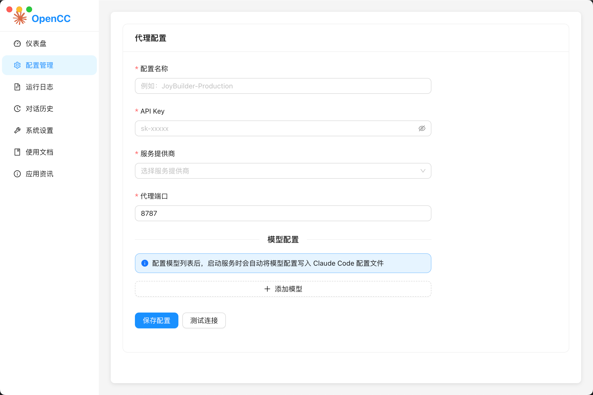
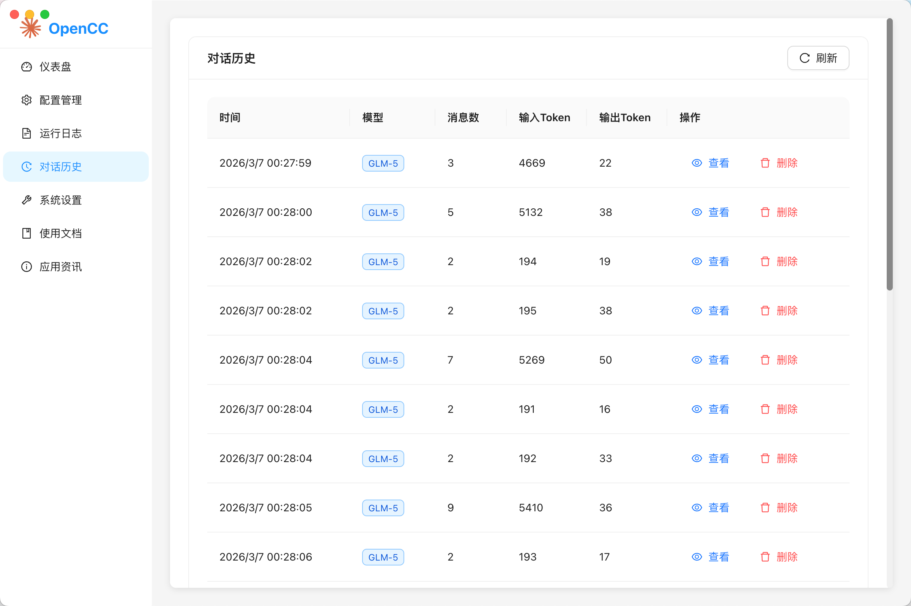

<div align="center">


# OpenCC

**让 Claude Code 接入任意大模型的终极解决方案**

[](LICENSE)
[](package.json)
[](https://www.apple.com/macos)
[](https://github.com/jiashuaiLu/opencc/stargazers)

**一个专为 macOS 设计的 Claude Code 代理服务管理工具**

用任意大模型，体验完整最新 Claude Code 功能的本地安全代理服务器！

[🚀 立即下载](#-快速开始) · [📖 使用文档](#-使用指南) · [🤝 参与贡献](#-贡献指南) · [💡 功能建议](https://github.com/jiashuaiLu/opencc/discussions)

</div>

---

## 🎯 为什么选择 OpenCC？

> **痛点**：Claude Code 只能使用 Claude 模型，费用高昂且受区域限制
> 
> **解决方案**：OpenCC 让你可以接入 OpenAI、DeepSeek、通义千问等任意兼容 OpenAI API 的大模型，享受 Claude Code 的强大功能！

### ✨ 核心优势

| 特性 | 说明 |
|------|------|
| 🎯 **零配置启动** | 图形化界面，无需手动编辑配置文件 |
| 💰 **成本可控** | 接入更经济的大模型，实时监控 Token 消耗 |
| 🔒 **本地安全** | 所有数据存储在本地，隐私有保障 |
| 📊 **可视化监控** | 实时查看运行日志、请求统计、Token 消耗 |
| 💬 **历史管理** | 完整的对话历史记录，支持搜索和导出 |
| 🔧 **环境检测** | 自动检测本地环境，确保依赖完整 |

---

## 📸 效果展示

### Claude Code 实际运行效果



*接入 DeepSeek 模型，Claude Code 完美运行代码生成任务*

### 功能界面预览

<table>
<tr>
<td width="50%">

<p align="center"><b>📊 度量看板</b></p>
<p align="center">实时监控 Token 消耗、请求统计</p>
</td>
<td width="50%">

<p align="center"><b>⚙️ 配置管理</b></p>
<p align="center">轻松配置多个模型服务</p>
</td>
</tr>
<tr>
<td width="50%">

<p align="center"><b>💬 对话历史</b></p>
<p align="center">完整的对话记录管理</p>
</td>
<td width="50%">
<p align="center"><b>🔧 环境检测</b></p>
<p align="center">自动检测本地环境依赖</p>
<p align="center">确保服务稳定运行</p>
</td>
</tr>
</table>

---

## 🚀 快速开始

### 系统要求

- **操作系统**: macOS 10.15 (Catalina) 或更高版本
- **Node.js**: v16.0.0 或更高版本（仅源码构建需要）
- **Claude Code**: 已安装并配置

### 安装方式

#### 方式一：下载安装包（推荐 ⭐）

1. 访问 [Releases](https://github.com/jiashuaiLu/opencc/releases) 页面
2. 下载最新版本的 `OpenCC-x.x.x-arm64.dmg`
3. 双击打开 DMG 文件，将应用拖拽到 Applications 文件夹
4. 打开应用，开始配置！

#### 方式二：从源码构建

```bash
# 克隆仓库
git clone https://github.com/jiashuaiLu/opencc.git
cd opencc

# 安装依赖
npm install

# 开发模式运行
npm run electron:dev

# 构建生产版本
npm run electron:build
```

---

## 📚 使用指南

### 1️⃣ 配置代理

首次使用时，需要进行基础配置：

1. 打开应用，进入「配置管理」页面
2. 输入配置名称（如："DeepSeek-Production"）
3. 输入 API Key（例如：`sk-xxxxx`）
4. 输入 Base URL（例如：`https://api.deepseek.com/v1`）
5. 设置代理端口（默认：8787）
6. 点击「保存配置」

### 2️⃣ 启动服务

配置完成后：

1. 回到「仪表盘」页面
2. 点击「启动服务」按钮
3. 等待服务启动完成（状态变为「运行中」）
4. 现在可以使用 Claude Code 了！

### 3️⃣ 配置 Claude Code

在 Claude Code 中设置代理：

```bash
# 设置代理地址
export ANTHROPIC_BASE_URL=http://localhost:8787/v1

# 运行 Claude Code
claude
```

---

## 🛠️ 技术栈

| 类别 | 技术 |
|------|------|
| 前端框架 | React 18 + TypeScript |
| 桌面框架 | Electron |
| UI 组件 | Ant Design |
| 状态管理 | Zustand |
| 图表 | Chart.js |
| 数据库 | SQLite (lowdb) |
| 日志 | Winston |
| 构建工具 | Vite + Electron Builder |

---

## 🎯 功能路线图

### v1.0.0 (当前版本) ✅

- [x] 基础框架搭建
- [x] 代理服务管理
- [x] 配置管理
- [x] 日志查看
- [x] 基础统计
- [x] 对话历史
- [x] 环境检测

### v1.1.0 (计划中)

- [ ] 高级统计分析
- [ ] 多配置管理
- [ ] 配置导入/导出
- [ ] 自动更新功能

### v1.2.0 (计划中)

- [ ] UI/UX 优化
- [ ] 性能优化
- [ ] 插件系统
- [ ] 主题定制

---

## 🤝 贡献指南

我们欢迎所有形式的贡献！无论是修复 Bug、添加新功能，还是改进文档，都是对项目的巨大帮助！

### 如何贡献

1. 🍴 Fork 本仓库
2. 🌿 创建特性分支 (`git checkout -b feature/AmazingFeature`)
3. 💻 编写代码并测试
4. 📝 提交更改 (`git commit -m 'Add some AmazingFeature'`)
5. 🚀 推送到分支 (`git push origin feature/AmazingFeature`)
6. 🔀 创建 Pull Request

### 贡献者福利

- 🏆 贡献者将在 README 中展示
- 🎁 优先获得新功能体验资格
- 💬 参与项目发展方向讨论

### 代码规范

- 使用 TypeScript 编写代码
- 遵循 ESLint 规则
- 使用 Prettier 格式化代码
- 编写清晰的提交信息

---

## 💡 功能建议

有好的想法？我们很乐意听取！

- 🐛 [报告 Bug](https://github.com/jiashuaiLu/opencc/issues/new?template=bug_report.md)
- 💡 [功能建议](https://github.com/jiashuaiLu/opencc/issues/new?template=feature_request.md)
- 💬 [参与讨论](https://github.com/jiashuaiLu/opencc/discussions)

---

## ⭐ Star History

如果这个项目对你有帮助，请给一个 ⭐ Star 支持一下！

[](https://star-history.com/#jiashuaiLu/opencc&Date)

---

## 📄 许可证

本项目采用 MIT 许可证 - 详见 [LICENSE](LICENSE) 文件

---

## 🙏 致谢

感谢以下开源项目：

[Electron](https://www.electronjs.org/) · [React](https://react.dev/) · [Ant Design](https://ant.design/) · [Vite](https://vitejs.dev/) · [TypeScript](https://www.typescriptlang.org/)

---

## 📞 联系方式

- **问题反馈**: [GitHub Issues](https://github.com/jiashuaiLu/opencc/issues)
- **功能建议**: [GitHub Discussions](https://github.com/jiashuaiLu/opencc/discussions)
- **邮件**: lujiashuai777@163.com

---

<div align="center">

**如果觉得项目不错，请给一个 ⭐ Star 支持开发者！**

**Made with ❤️ by OpenCC Team**

</div>
